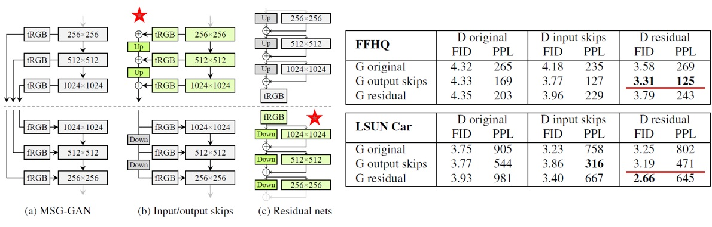

## Style GAN2 - using TensorFlow 2.1  

  

Tensorflow 2.1 implementation for Nvidia style GAN2
[Result_A1](./Images/SG2_result_A1.jpg)  
[Result_A2](./Images/SG2_result_A2.jpg)  
[Result_B1](./Images/SG2_result_B1.jpg)  

----
## Style GAN2 Implementation  
  
### Generator and discriminator network  
>Style GAN2 paper did vast body of works to compare the performance for different network (original, skip connection, residual network). Generator with skip connection and discriminator with residul network together achieve best FID and PPL performance.  
>  

### Hyperparameter settings:  
The hyperparameters for training are:    
> Repository:   FFHQ 512 x 512, total 70000 images  
> Batch size:   8  
> Optimizer:    Adam with beta1= 0.00; beta2= 0.99 and learning rate = 0.0002  
> Truncation:   Disentangle latent space truncation phi = 0.7  
> EMA rate:     0.9999  
> Loss type:    Non-saturation loss with R1 regularization (GP=10)  
> nCritic:      Learning rate D/G = 2  

### Function not implemented in this code
> The training runs on single Nvidia RTX2080-Ti GPU. To make the training practical, some optimization is employed:    
> (1) Capacity of generator and discriminator is 4X smaller  
> (2) Image resolution is reduced to 512 x 512  
> (3) Equalization learning rate function is not implemented  
> (4) Perceptual path length regularization is not implemented  
> (5) Lazy regularization is not implemented  

----
## Reference:
> **Progressive Growing of GANs for Improved Quality, Stability, and Variation**  
> (PG-GAN)
> Tero Karras, Timo Aila, Samuli Laine, Jaakko Lehtinen  
> [PDF] https://arxiv.org/abs/1710.10196 [CODE]  
>
> **A Style-Based Generator Architecture for Generative Adversarial Networks**  
> (Style-GAN) 
> Tero Karras, Samuli Laine, Timo Aila  
> [PDF] https://arxiv.org/abs/1812.04948 [CODE]  
>
> **Analyzing and Improving the Image Quality of StyleGAN**  
> (Style GAN2)
> Tero Karras, Samuli Laine, Miika Aittala, Janne Hellsten, Jaakko Lehtinen, Timo Aila  
> [PDF] https://arxiv.org/abs/1912.04958 

----
## Usage:  
 

----
## More results:
[Result_B2](./Images/SG2_result_B2.jpg)  
[Result_B3](./Images/SG2_result_B3.jpg)  

